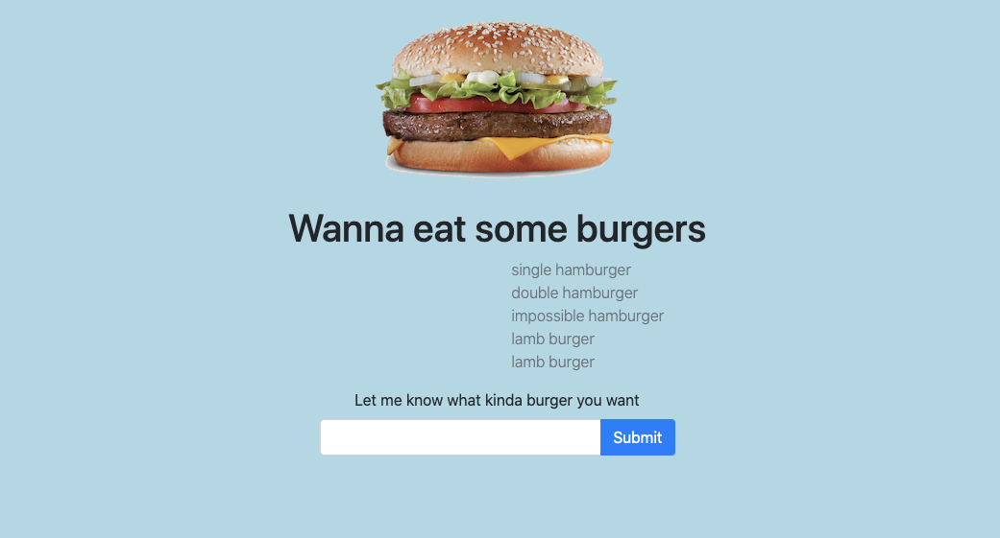

# Eat-Da-Burger!

A burger app using node, mysql, express, handlebars

## Table of Contents

- [Installation](#installation)
- [Usage](#usage)
- [Contributing](#contributing)
- [Tests](#tests)
- [Questions](#questions)
- [Credits](#credits)
- [License](#license)

## Installation

from command line in project directory run node server.js

[back to Table of Contents](#table-of-contents)

## Usage

You can use this app at your leisure

## License

no license required

[back to Table of Contents](#table-of-contents)
